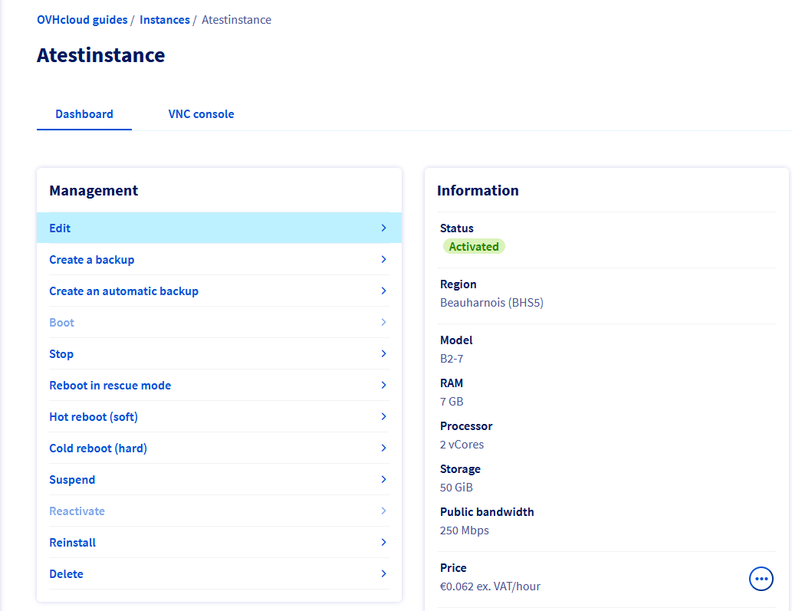

**Last updated 24th September 2021**

## Introduction

Following an increase in activity, or simply new needs, it is possible that your instance cannot meet this new load due to a lack of resources. With the Public Cloud, you can increase the resources available to your instance with just a few clicks.

**This guide explains how to resize your instance via the OVHcloud Control Panel**

> [!alert]
> Only upscaling is possible for classic models. This will also cause the instance to be shut down for the duration of the process.
>

> [!success]
> Flex instances allow resizing to higher or lower models with a single disk size(50GB).
>

## Requirements

- an [OVHcloud Public Cloud instance](../create_an_instance_in_your_ovh_customer_account/)
- access to the [OVHcloud Control Panel](https://ca.ovh.com/auth/?action=gotomanager&from=https://www.ovh.com/ca/en/&ovhSubsidiary=ca){.external}

## Instructions

### Editing the instance

Log in to the [OVHcloud Control Panel](https://ca.ovh.com/auth/?action=gotomanager&from=https://www.ovh.com/ca/en/&ovhSubsidiary=ca), click on the `Public Cloud`{.action} section menu, then click on the `Instances`{.action} in the left side menu.

{.thumbnail}

Click on the instance name to edit and click on `Edit`{.action} in the dashboard.

{.thumbnail}

### Instance name and Image

This section allows you to edit the Instance name and Image.

{.thumbnail}

> [!alert]
> If you select a different image, all of the data stored on the instance will be deleted. This action is irreversible. 
>
> It is not possible to switch from a linux image to a windows image and vice versa.
>

### Template 

This section allows you to select a new Template for your instance. 

{.thumbnail}

> [!warning]
> Depending on the quota (resources) you have left on your project, some templates will not be available. In such cases, you will need to [increase your Public Cloud quota](https://docs.ovh.com/ca/en/public-cloud/increase-public-cloud-quota/) first.
> 

### Instance type and billing period

This section allows you to modify your billing period or to switch your instance to the flex option if needed. For more information, please consult this guide: [Switching from hourly to monthly billing](https://docs.ovh.com/ca/en/public-cloud/change-public-cloud-billing-rate/).

{.thumbnail}

Once done, apply the changes. The instance will be shutdown and rebooted during the operation.

## Go further

Join our community of users on <https://community.ovh.com/en/>.