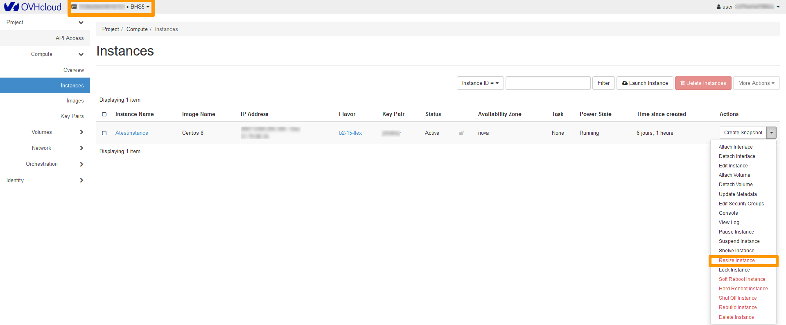
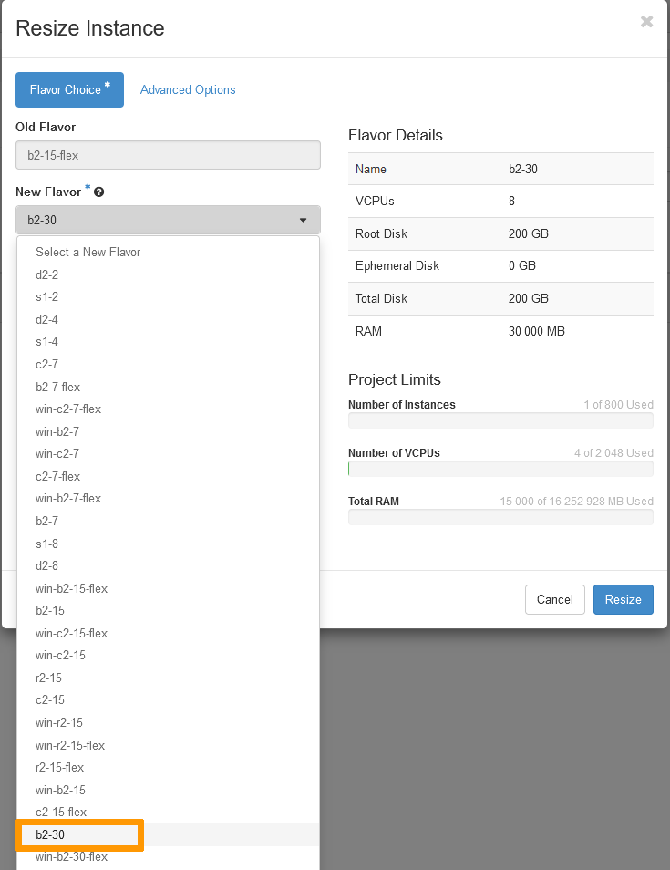
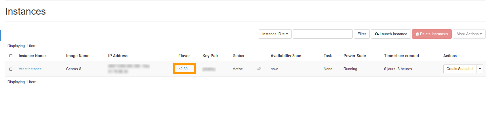

**Last updated 24th September 2021**

## Objective

A flex instance is a single size disk instance which offers a faster process for snapshots. It allows resizing to higher or lower models with a fix storage space whereas classic models can only be resized to higher models. As your infrastructure is constantly evolving, you may need to resize your instance as well as the storage space. In this case, you will need to « revert » your flex instance to a classic model to upgrade it. 

This action can only be done from the Horizon interface.

**This guide shows you how to resize your flex instance from the OpenStack Horizon interface.**

## Requirements

- a flex [OVHcloud Public Cloud instance](../create_an_instance_in_your_ovh_customer_account/) 
- [Create an access to the Horizon interface](https://docs.ovh.com/ca/en/public-cloud/configure_user_access_to_horizon/)
- access to the [Horizon interface](https://horizon.cloud.ovh.net/auth/login/)

## Instructions

Log into the [Horizon interface](https://horizon.cloud.ovh.net/auth/login/), and make sure you are in the correct region. You can verify this on the top left corner. Next, click on the `Compute`{.action} menu on the left side and select `Instances`{.action}. Select `Resize Instance`{.action} in the drop list for the corresponding instance.

{.thumbnail}

This section allows you to select the new instance « flavor » or « model ». In our example, our instance is a « b2-15-flex » model and we want to upgrade it to a « b2-30 » classic model.

> [!warning] 
> You can only switch from a linux model to another linux model or from a windows model to another windows model.
>

{.thumbnail}

To continue, click on the `Resize`{.action} button.

Your instance will be rebooted and the changes will be applied. Once done, you will have a classic instance and a larger storage space.

{.thumbnail}

In case you wish to revert back to a flex model, this can be done by performing the same steps mentioned above and in the « flavor » menu, select a « flex model » instead. 

Alternatively, you can [edit the instance](https://docs.ovh.com/ca/en/public-cloud/edit-an-instance) back in the OVHcloud Control Panel.

## Go further

Join our community of users on <https://community.ovh.com/en/>.